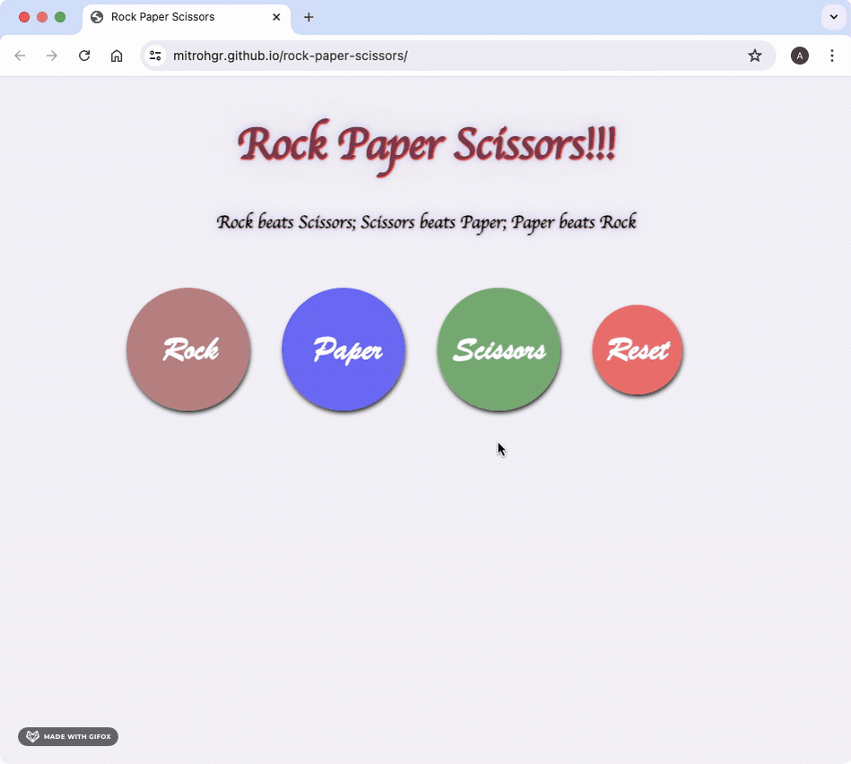
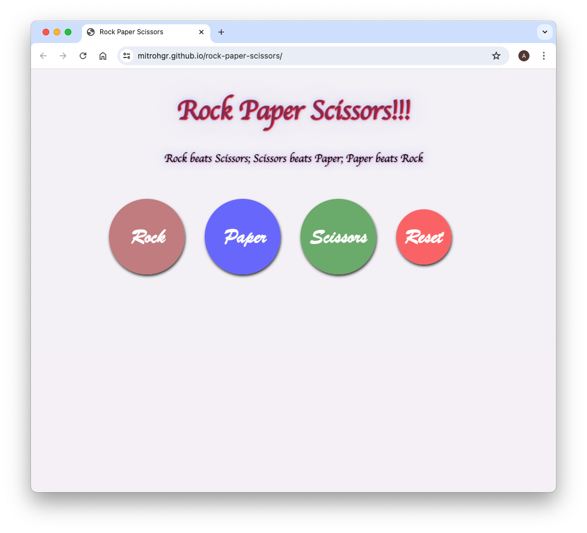
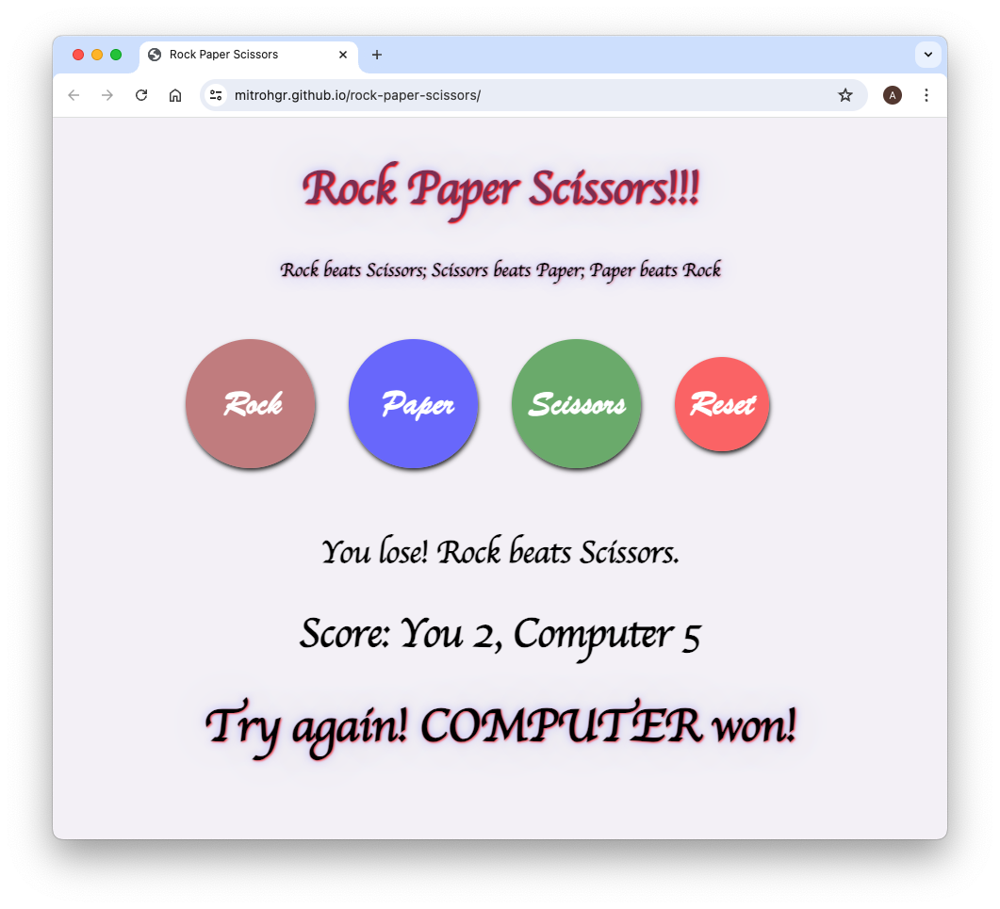

# rock-paper-scissors
A Game of Rock Paper Scissors

## Demo

## Status

***This project will no longer be worked upon.***

This is because the [Learning to Code](https://dev.to/theodinproject/learning-code-f56) section of the [Becoming a TOP Success Story](https://dev.to/i3uckwheat/series/16683) makes it clear to [only focus on the point of the assignment](https://dev.to/theodinproject/learning-code-f56) and that [foundations isn't a strong portfolio generator](https://dev.to/theodinproject/learning-code-f56).

## General Info

**rock-paper-scissors** is the [third project](https://www.theodinproject.com/lessons/foundations-rock-paper-scissors) from the [Foundations Course](https://www.theodinproject.com/paths/foundations/courses/foundations) in [The Odin Project](https://www.theodinproject.com/about).

Here, I first create a game of "Rock Paper Scissors" which was originally played entirely in the console, then, later on, I update it to a full fledged browser based version with a graphical user interface.

## Screenshots

## Technologies

+ ***CLI***
+ ***Git***
+ ***GitHub***
+ ***HTML***
+ ***GitHub Pages***
+ ***CSS***
+ ***JavaScript***

## Self-reflections

> This is the best project I've worked so far. I've learnt quite a lot of things: stuff like variables and operators, data types and conditionals, javascript developer tools, function basics, and array and loops. Some of the more important things were: how to solve problems (the three-tiered approach), understanding errors, writing clean code (and several principles), manipulating the DOM and handling events, and also installing Node.js.

> [!NOTE]
> I was hesitating every single time to use the developer tools initially. There was nothing really that difficult in this particular project but whenever I was stuck with error messages, I noticed that the developer tools provided the best help. Using the debugger, using breakpoints, and specifically watching the value of a few variables helped me right away. This is probably the most important part of doing this project. Whether there is a disparity in the margin/padding or there is some issue with wrong output in JavaScript, the developer tools and debugging will be the greatest help.

## Acknowledgements

+ *Credit* for the ***text*** goes to [wikiHow](https://www.wikihow.com/Play-Rock,-Paper,-Scissors)

## Contact and Support

+ Feel free to contact ***mitrohgr_03505*** on discord for project-related queries.
+ No further feature modifications or improvements will be done to this project.
